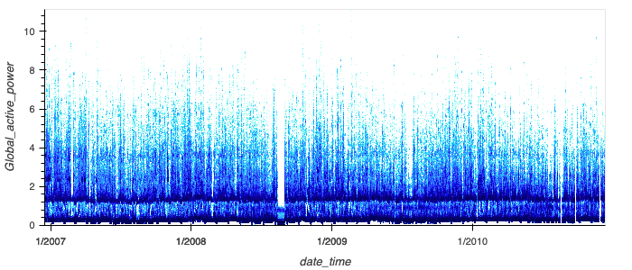
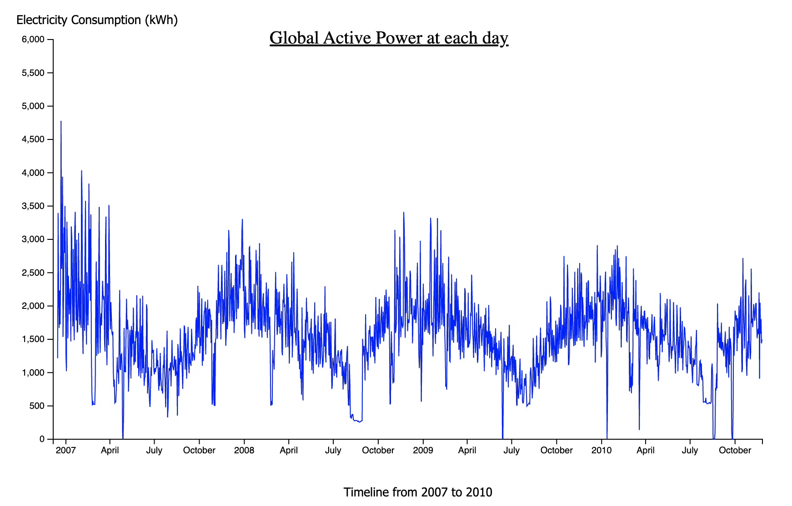

# Global Active Power(Electricity) Visualization

## Scatter Plot Visualization

### Explanation:
Using the scatter heat map, it was found that from January 2007 to January 2011, most Global Active Power points fell in the 1 to 4 range, with a few falling in the 4 to 8 range, indicating a mainstream electricity use range of 2-4. it is worth noting, however, that there was a significant power shortfall in July 2008 that required identify the cause.

### Remarks：
Each data point records the Global Active Power value per second

## Daily Global Active Power Sum Values:

### Explanation:
The daily aggregated global active power was found to have a clear monthly cycle, with the lowest value in July and the highest value in December, which is in line with the residents' living habits of increasing electricity consumption for heating in winter. The global active power in January 07 was found to be much higher than normal, and needs to be investigated to see if the anomaly was caused by extreme weather or power leaks.

